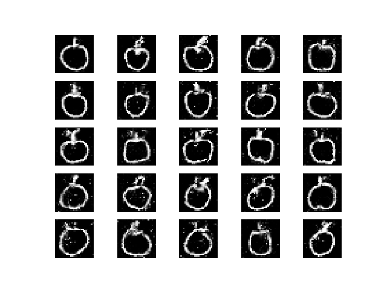
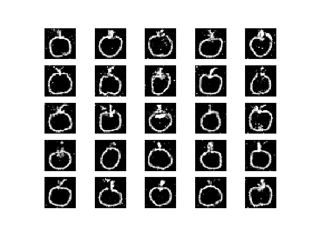

# SimpleGAN
A keras implementation of a simple GAN. The objective is to produce grayscale doodles of apples!
Here's a small GAN in keras to get you started!
The apples doodle data can be found here - https://console.cloud.google.com/storage/browser/quickdraw_dataset/full/numpy_bitmap?pli=1

As you can see, the generator soon learns to generate genuine enough doodles of apples after 30,000 epochs.
